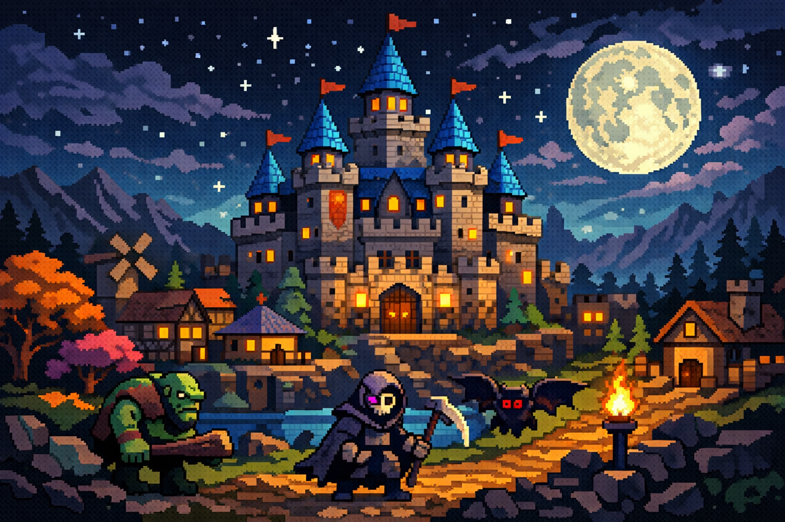

# Super Fantasy Kingdom: Art Style and Visual Influences

Super Fantasy Kingdom is presented in a retro pixel‑art style that combines the charm of classic strategy games with modern readability.  Several reviewers note that the game’s visuals are **reminiscent of early titles such as *The Settlers* and *Vampire Survivors***.  For example, an article on GamesMarkt describes the game as a “retro‑pixel art” city builder that mixes resource management and automatic defence battles【5124544752661†L27-L44】.  TrueAchievements similarly remarks that the pixelated style recalls *Vampire Survivors*【834830160931644†L85-L90】.  The Epic Games Store points out that the game begins with a **small pixel castle and pathways to tiny houses and graveyards**; its retro look, inspired by *The Settlers* and *Stronghold*, helps players quickly recognise buildings and resources【955100408868214†L28-L70】.

## Top‑down isometric world

Players view the kingdom from a **top‑down, isometric perspective**, much like classic strategy and role‑playing games.  Game Luster’s preview notes that the game uses *simple pixel art and animations* with a colourful theme, and that this visual design “is charming and reminiscent of classic RPGs”【23171914065312†L70-L76】.  Another preview from SteamDeckHQ highlights that the game opens with a “pretty isometric kingdom shrouded in darkness,” and that its art style initially looks simple but hides surprising depth【937127750608205†L42-L48】【937127750608205†L50-L77】.  Because the kingdom is rendered on a grid, buildings and units are clearly delineated, and players can easily identify where to place new structures or defend against monsters.

## Inspirations and influences

Super Fantasy Kingdom’s art draws on **multiple influences**.  The developer cites inspiration from *The Settlers* and *Stronghold*, which emphasise colourful medieval buildings and resource transport chains【955100408868214†L28-L70】.  Reviewers also compare the aesthetic to *dotAGE*, another modern pixel‑art strategy game【937127750608205†L42-L48】.  While these influences are clear, Super Fantasy Kingdom maintains its own identity by combining bright colours and cute characters with gloomy environmental effects; the initial darkness of the land gradually lifts as players rebuild and expand【937127750608205†L50-L77】.  This juxtaposition of vibrant pixels and creeping shadow underscores the roguelike theme of rebuilding after defeat.

## Minimalist interface

The game’s **minimalist interface** keeps the focus on city‑building and combat rather than on menus.  Galaxus notes that the interface consists of only essential information—resources and build commands—and that the cycle of building by day and defending at night is the core of the experience【714652172019561†L91-L152】.  This lean design allows the pixel art to stand out without clutter and reinforces the game’s relaxing, “slow‑building” atmosphere【714652172019561†L91-L152】.  According to Game Luster, the top‑down viewpoint and colourful palette enhance the experience without distracting from the underlying strategy【23171914065312†L70-L76】.

## Sample depiction

Below is a decorative illustration inspired by Super Fantasy Kingdom’s retro aesthetic.  The image shows a pixel‑art castle and vibrant forest landscape reminiscent of the game’s colourful fantasy world.

